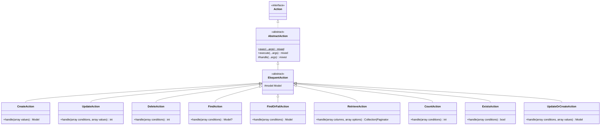
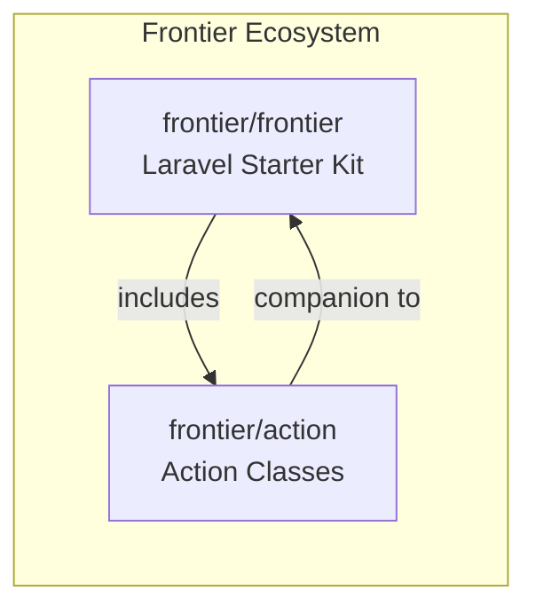

# Frontier Action Package - AI Guide

> **Package**: `frontier/action`  
> **Version**: Compatible with Laravel 10.x, 11.x, 12.x  
> **Namespace**: `Frontier\Actions`

A companion package to [frontier/frontier](https://github.com/frontier/frontier) that provides a clean Action pattern implementation for encapsulating business logic in Laravel applications.

---

## Table of Contents

- [Overview](#overview)
- [Architecture](#architecture)
- [Core Components](#core-components)
- [Design Patterns](#design-patterns)
- [Installation](#installation)
- [Usage Guide](#usage-guide)
- [Code Examples](#code-examples)
- [Testing Actions](#testing-actions)
- [When to Use Actions](#when-to-use-actions)
- [Extension & Customization](#extension--customization)
- [Relationship to frontier/frontier](#relationship-to-frontierfrontier)
- [File Reference](#file-reference)

---

## Overview

The `frontier/action` package implements the **Action Pattern** (also known as Command Pattern or Single Action Classes) to:

- **Encapsulate business logic** in single-responsibility classes
- **Keep controllers thin** by delegating operations to Actions
- **Improve testability** through isolated, focused units
- **Provide reusable operations** across controllers, commands, jobs, etc.
- **Standardize CRUD operations** with pre-built Eloquent actions

### Key Features

| Feature | Description |
|---------|-------------|
| Static `exec()` method | Execute actions without manual instantiation |
| Dependency injection | Full Laravel container support via `App::make()` |
| Eloquent integration | Pre-built actions for common database operations |
| Artisan generator | `frontier:action` command for scaffolding |
| Extensible design | Abstract classes for custom implementations |

---

## Architecture



### Package Structure

```
frontier-action/
├── composer.json           # Package metadata & autoloading
├── resources/
│   └── stubs/
│       └── action.stub     # Template for generated actions
└── src/
    ├── AbstractAction.php  # Base action with exec() & execute()
    ├── EloquentAction.php  # Eloquent model integration layer
    ├── Contracts/
    │   └── Action.php      # Action marker interface
    ├── Console/
    │   └── Commands/
    │       ├── AbstractMake.php   # Base generator command
    │       └── MakeAction.php     # frontier:action command
    ├── Providers/
    │   └── ServiceProvider.php    # Laravel service provider
    └── [Pre-built Actions]/
        ├── CreateAction.php
        ├── UpdateAction.php
        ├── DeleteAction.php
        ├── FindAction.php
        ├── FindOrFailAction.php
        ├── RetrieveAction.php
        ├── CountAction.php
        ├── ExistsAction.php
        └── UpdateOrCreateAction.php
```

---

## Core Components

### 1. Action Contract (`Contracts\Action`)

A marker interface that identifies classes as Actions. Used for type-hinting and IDE support.

```php
interface Action {}
```

### 2. AbstractAction

The foundation of all Actions. Provides:

- **`exec(...$arguments)`**: Static method that resolves the action via Laravel's container and executes it
- **`execute(...$arguments)`**: Instance method that validates and calls `handle()`
- **Dependency Injection**: Uses `App::make()` for automatic constructor injection

```php
abstract class AbstractAction implements Contracts\Action
{
    public static function exec(...$arguments): mixed
    {
        return App::make(static::class)->execute(...$arguments);
    }

    public function execute(...$arguments): mixed
    {
        // Ensures handle() method exists
        return $this->handle(...$arguments);
    }
}
```

### 3. EloquentAction

Abstract class for database operations. Adds a protected `$model` property for Eloquent models.

```php
abstract class EloquentAction extends AbstractAction
{
    protected Model $model;
}
```

### 4. Pre-built Eloquent Actions

| Action | Method Signature | Returns | Description |
|--------|-----------------|---------|-------------|
| `CreateAction` | `handle(array $values)` | `Model` | Create a new model |
| `UpdateAction` | `handle(array $conditions, array $values)` | `int` | Update matching records |
| `DeleteAction` | `handle(array $conditions)` | `int` | Delete matching records |
| `FindAction` | `handle(array $conditions)` | `?Model` | Find first matching record |
| `FindOrFailAction` | `handle(array $conditions)` | `Model` | Find or throw 404 |
| `RetrieveAction` | `handle(array $columns, array $options)` | `Collection\|Paginator` | Get all or paginated |
| `CountAction` | `handle(array $conditions)` | `int` | Count matching records |
| `ExistsAction` | `handle(array $conditions)` | `bool` | Check if records exist |
| `UpdateOrCreateAction` | `handle(array $conditions, array $values)` | `Model` | Upsert operation |

### 5. Service Provider

Auto-discovered by Laravel. Registers the `frontier:action` Artisan command.

---

## Design Patterns

### 1. Action Pattern (Command Pattern)

Each action encapsulates a single business operation with:
- A clear, single responsibility
- An `exec()` entry point for execution
- Dependency injection support

### 2. Template Method Pattern

`AbstractAction::execute()` defines the skeleton:
1. Validate `handle()` method exists
2. Call `handle()` with arguments

Subclasses implement the specific `handle()` logic.

### 3. Factory Pattern

`AbstractAction::exec()` acts as a factory, using Laravel's container to instantiate actions with dependencies.

### 4. Marker Interface Pattern

`Contracts\Action` serves as a marker for type identification.

---

## Installation

### Via Composer

```bash
composer require frontier/action
```

### Service Provider Auto-Discovery

Laravel automatically discovers the service provider. For manual registration:

```php
// config/app.php
'providers' => [
    Frontier\Actions\Providers\ServiceProvider::class,
],
```

---

## Usage Guide

### Creating a New Action

Use the Artisan command:

```bash
php artisan frontier:action CreateUser
```

This generates `app/Actions/CreateUser.php`:

```php
<?php

namespace App\Actions;

use Frontier\Actions\EloquentAction as FrontierAction;

class CreateUser extends FrontierAction
{
    public function handle()
    {
        // Your business logic here
    }
}
```

### Executing Actions

#### Option 1: Static Execution (Recommended)

```php
use App\Actions\CreateUser;

$user = CreateUser::exec($userData);
```

#### Option 2: Instance Execution

```php
use App\Actions\CreateUser;

$action = app(CreateUser::class);
$user = $action->execute($userData);
```

---

## Code Examples

### Example 1: Basic Action with Dependencies

```php
<?php

namespace App\Actions;

use App\Models\User;
use App\Services\EmailService;
use Frontier\Actions\AbstractAction;
use Illuminate\Support\Facades\Hash;

class CreateUserAction extends AbstractAction
{
    public function __construct(
        private EmailService $emailService
    ) {}

    public function handle(array $data): User
    {
        $user = User::create([
            'name' => $data['name'],
            'email' => $data['email'],
            'password' => Hash::make($data['password']),
        ]);

        $this->emailService->sendWelcome($user);

        return $user;
    }
}
```

**Usage in Controller:**

```php
<?php

namespace App\Http\Controllers;

use App\Actions\CreateUserAction;
use App\Http\Requests\CreateUserRequest;
use Illuminate\Http\JsonResponse;

class UserController extends Controller
{
    public function store(CreateUserRequest $request): JsonResponse
    {
        $user = CreateUserAction::exec($request->validated());

        return response()->json($user, 201);
    }
}
```

### Example 2: Extending Pre-built Eloquent Actions

```php
<?php

namespace App\Actions\User;

use App\Models\User;
use Frontier\Actions\CreateAction;

class CreateUser extends CreateAction
{
    protected User $model;

    public function __construct()
    {
        $this->model = new User();
    }
}
```

**Usage:**

```php
use App\Actions\User\CreateUser;

$user = CreateUser::exec([
    'name' => 'John Doe',
    'email' => 'john@example.com',
    'password' => bcrypt('secret'),
]);
```

### Example 3: RetrieveAction with Pagination

```php
<?php

namespace App\Actions\User;

use App\Models\User;
use Frontier\Actions\RetrieveAction;

class ListUsers extends RetrieveAction
{
    public function __construct()
    {
        $this->model = new User();
    }
}
```

**Usage:**

```php
use App\Actions\User\ListUsers;

// Get all users
$users = ListUsers::exec(['id', 'name', 'email']);

// Get paginated users (15 per page)
$users = ListUsers::exec(['*'], ['per_page' => 15]);
```

### Example 4: Complex Business Logic Action

```php
<?php

namespace App\Actions\Order;

use App\Models\Order;
use App\Models\Product;
use App\Services\PaymentGateway;
use App\Services\InventoryService;
use Frontier\Actions\AbstractAction;
use Illuminate\Support\Facades\DB;

class PlaceOrderAction extends AbstractAction
{
    public function __construct(
        private PaymentGateway $payment,
        private InventoryService $inventory
    ) {}

    public function handle(array $items, string $paymentMethod): Order
    {
        return DB::transaction(function () use ($items, $paymentMethod) {
            // Reserve inventory
            $this->inventory->reserve($items);

            // Calculate total
            $total = collect($items)->sum(fn($item) => 
                Product::find($item['product_id'])->price * $item['quantity']
            );

            // Process payment
            $paymentResult = $this->payment->charge($total, $paymentMethod);

            // Create order
            $order = Order::create([
                'total' => $total,
                'payment_id' => $paymentResult->id,
                'status' => 'confirmed',
            ]);

            $order->items()->createMany($items);

            return $order;
        });
    }
}
```

---

## Testing Actions

Actions are highly testable due to their isolation and dependency injection support.

### Unit Testing

```php
<?php

namespace Tests\Unit\Actions;

use App\Actions\CreateUserAction;
use App\Models\User;
use App\Services\EmailService;
use Illuminate\Foundation\Testing\RefreshDatabase;
use Mockery;
use Tests\TestCase;

class CreateUserActionTest extends TestCase
{
    use RefreshDatabase;

    public function test_creates_user_and_sends_welcome_email(): void
    {
        // Arrange
        $emailService = Mockery::mock(EmailService::class);
        $emailService->shouldReceive('sendWelcome')->once();

        $this->app->instance(EmailService::class, $emailService);

        $data = [
            'name' => 'John Doe',
            'email' => 'john@example.com',
            'password' => 'password123',
        ];

        // Act
        $user = CreateUserAction::exec($data);

        // Assert
        $this->assertInstanceOf(User::class, $user);
        $this->assertDatabaseHas('users', ['email' => 'john@example.com']);
    }
}
```

### Testing Pre-built Actions

```php
<?php

namespace Tests\Unit\Actions;

use App\Actions\User\CreateUser;
use App\Models\User;
use Illuminate\Foundation\Testing\RefreshDatabase;
use Tests\TestCase;

class CreateUserTest extends TestCase
{
    use RefreshDatabase;

    public function test_creates_user(): void
    {
        $user = CreateUser::exec([
            'name' => 'Jane Doe',
            'email' => 'jane@example.com',
            'password' => bcrypt('secret'),
        ]);

        $this->assertInstanceOf(User::class, $user);
        $this->assertEquals('jane@example.com', $user->email);
    }
}
```

### Integration Testing with Controllers

```php
<?php

namespace Tests\Feature;

use App\Actions\CreateUserAction;
use App\Models\User;
use Illuminate\Foundation\Testing\RefreshDatabase;
use Tests\TestCase;

class UserControllerTest extends TestCase
{
    use RefreshDatabase;

    public function test_store_creates_user(): void
    {
        $response = $this->postJson('/api/users', [
            'name' => 'Test User',
            'email' => 'test@example.com',
            'password' => 'password123',
        ]);

        $response->assertStatus(201)
            ->assertJsonStructure(['id', 'name', 'email']);
    }
}
```

---

## When to Use Actions

### ✅ Use Actions When:

| Scenario | Benefit |
|----------|---------|
| Business logic spans multiple models | Centralized coordination |
| Same operation needed in multiple places | DRY principle |
| Logic requires external services | Easy to mock and test |
| Controller methods become complex | Clean separation |
| Operations need transaction handling | Encapsulated DB transactions |

### ❌ Consider Alternatives When:

| Scenario | Alternative |
|----------|-------------|
| Simple CRUD with no logic | Use controller directly |
| Model-specific behavior | Use Eloquent accessors/mutators |
| Cross-cutting concerns | Use middleware |
| Queued/async operations | Use Jobs |
| Scheduled tasks | Use Console Commands |
| Complex queries | Use Query Builders or Repositories |

### Actions vs Other Patterns

```
┌─────────────────┬────────────────────────────────────────┐
│ Pattern         │ Best For                               │
├─────────────────┼────────────────────────────────────────┤
│ Actions         │ Single business operations             │
│ Services        │ Multiple related operations            │
│ Repositories    │ Data access abstraction               │
│ Jobs            │ Queued/async processing               │
│ Events/Listeners│ Decoupled side effects                │
│ Policies        │ Authorization logic                    │
└─────────────────┴────────────────────────────────────────┘
```

---

## Extension & Customization

### Creating a Custom Base Action

```php
<?php

namespace App\Actions;

use Frontier\Actions\AbstractAction;
use Illuminate\Support\Facades\Log;

abstract class LoggedAction extends AbstractAction
{
    public function execute(...$arguments): mixed
    {
        Log::info(sprintf('Executing %s', static::class), [
            'arguments' => $arguments
        ]);

        try {
            $result = parent::execute(...$arguments);
            
            Log::info(sprintf('Completed %s', static::class));
            
            return $result;
        } catch (\Throwable $e) {
            Log::error(sprintf('Failed %s: %s', static::class, $e->getMessage()));
            throw $e;
        }
    }
}
```

### Creating Custom Eloquent Actions

```php
<?php

namespace App\Actions;

use Frontier\Actions\EloquentAction;
use Illuminate\Database\Eloquent\Model;
use Illuminate\Database\Eloquent\SoftDeletes;

class SoftDeleteAction extends EloquentAction
{
    public function handle(array $conditions): int
    {
        if (!in_array(SoftDeletes::class, class_uses_recursive($this->model))) {
            throw new \RuntimeException('Model does not support soft deletes');
        }

        return $this->model->query()->where($conditions)->delete();
    }
}
```

### Adding Hooks/Events

```php
<?php

namespace App\Actions\User;

use App\Events\UserCreated;
use App\Models\User;
use Frontier\Actions\CreateAction;

class CreateUser extends CreateAction
{
    protected User $model;

    public function __construct()
    {
        $this->model = new User();
    }

    public function handle(array $values): \Illuminate\Database\Eloquent\Model
    {
        $user = parent::handle($values);

        event(new UserCreated($user));

        return $user;
    }
}
```

### Customizing the Generator Stub

Override the stub in your application by creating:

```
resources/stubs/vendor/frontier/action.stub
```

Or publish stubs and modify:

```bash
php artisan vendor:publish --tag=frontier-stubs
```

---

## Relationship to frontier/frontier

The `frontier/action` package is part of the **Frontier ecosystem**:



### Integration Points

| Component | frontier/frontier | frontier/action |
|-----------|-------------------|-----------------|
| **Purpose** | Full Laravel starter kit | Action pattern library |
| **Scope** | Complete application scaffold | Business logic encapsulation |
| **Usage** | Install for new projects | Add to any Laravel project |
| **Dependency** | Includes action package | Standalone package |

### Using Together

When using `frontier/frontier`, the action package is automatically included. Your generated modules can use actions for business logic:

```php
// In a Frontier module controller
use App\Modules\Users\Actions\CreateUserAction;

class UserController extends Controller
{
    public function store(CreateUserRequest $request)
    {
        return CreateUserAction::exec($request->validated());
    }
}
```

---

## File Reference

| File | Purpose | Key Elements |
|------|---------|--------------|
| [composer.json](file:///var/www/html/rai/up/frontier-action/composer.json) | Package definition | Namespace mapping, dependencies, auto-discovery |
| [AbstractAction.php](file:///var/www/html/rai/up/frontier-action/src/AbstractAction.php) | Base action class | `exec()`, `execute()` methods |
| [EloquentAction.php](file:///var/www/html/rai/up/frontier-action/src/EloquentAction.php) | Model-aware base | Protected `$model` property |
| [Action.php](file:///var/www/html/rai/up/frontier-action/src/Contracts/Action.php) | Contract interface | Marker interface |
| [CreateAction.php](file:///var/www/html/rai/up/frontier-action/src/CreateAction.php) | Create records | `handle(array $values)` |
| [UpdateAction.php](file:///var/www/html/rai/up/frontier-action/src/UpdateAction.php) | Update records | `handle(array $conditions, array $values)` |
| [DeleteAction.php](file:///var/www/html/rai/up/frontier-action/src/DeleteAction.php) | Delete records | `handle(array $conditions)` |
| [FindAction.php](file:///var/www/html/rai/up/frontier-action/src/FindAction.php) | Find single record | `handle(array $conditions)` |
| [FindOrFailAction.php](file:///var/www/html/rai/up/frontier-action/src/FindOrFailAction.php) | Find or 404 | `handle(array $conditions)` |
| [RetrieveAction.php](file:///var/www/html/rai/up/frontier-action/src/RetrieveAction.php) | List with pagination | `handle(array $columns, array $options)` |
| [CountAction.php](file:///var/www/html/rai/up/frontier-action/src/CountAction.php) | Count records | `handle(array $conditions)` |
| [ExistsAction.php](file:///var/www/html/rai/up/frontier-action/src/ExistsAction.php) | Check existence | `handle(array $conditions)` |
| [UpdateOrCreateAction.php](file:///var/www/html/rai/up/frontier-action/src/UpdateOrCreateAction.php) | Upsert operation | `handle(array $conditions, array $values)` |
| [MakeAction.php](file:///var/www/html/rai/up/frontier-action/src/Console/Commands/MakeAction.php) | Artisan command | `frontier:action {name}` |
| [AbstractMake.php](file:///var/www/html/rai/up/frontier-action/src/Console/Commands/AbstractMake.php) | Generator base | Stub processing logic |
| [ServiceProvider.php](file:///var/www/html/rai/up/frontier-action/src/Providers/ServiceProvider.php) | Laravel provider | Command registration |
| [action.stub](file:///var/www/html/rai/up/frontier-action/resources/stubs/action.stub) | Generator template | Action class scaffold |

---

## Quick Reference

### Common Operations

```php
// Create
CreateUserAction::exec(['name' => 'John', 'email' => 'john@example.com']);

// Read (single)
FindUserAction::exec(['id' => 1]);

// Read (list)
ListUsersAction::exec(['*'], ['per_page' => 10]);

// Update
UpdateUserAction::exec(['id' => 1], ['name' => 'Jane']);

// Delete
DeleteUserAction::exec(['id' => 1]);

// Exists check
UserExistsAction::exec(['email' => 'john@example.com']);

// Count
CountUsersAction::exec(['active' => true]);

// Upsert
UpdateOrCreateUserAction::exec(
    ['email' => 'john@example.com'],  // conditions
    ['name' => 'John Doe']            // values
);
```

### Generator Command

```bash
# Create a new action
php artisan frontier:action MyAction

# Creates: app/Actions/MyAction.php
```

---

*This documentation is designed for both AI assistants and developers. For AI tools: key patterns are the static `exec()` method for execution and the `handle()` method for business logic implementation.*
